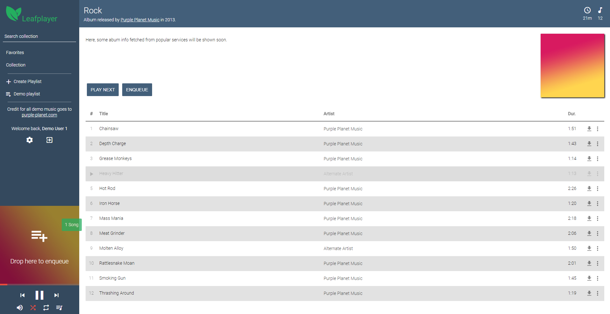

<p align="center"></p>

# LeafPlayer

LeafPlayer is a privately hosted music streaming server. It enables you to access your private music collection from anywhere where there's internet access.

## Demo
There is a demo available at [https://leafplayerdemo.paulschwoerer.de](https://leafplayerdemo.paulschwoerer.de).

- Username: demo1 / demo2
- Password: demodemo123

Try dragging albums, artists and songs onto the player and the playlists in the sidebar.

I removed the ability to change password and download songs from the demo.

<p align="center"></p>

## Quick start

To use LeafPlayer, you need to own a server, capable of running the [Lumen PHP framework](https://lumen.laravel.com/) and a supported database, for example MySQL.

### Installation
First download the latest release and copy it's contents to the root of your webspace. Following that, run the following commands from within that directory. 

```sh
# Install dependencies
composer install

# Rename .env.example to .env
mv .env.example .env

# Generate app secret
php artisan key:generate

# Generate JWT secret
php artisan jwt:secret

# Create tables in database
php artisan migrate

# Seed database with the administration user
php artisan db:seed
```
After you've finished entering those commands, you should be able to login with the admin credentials when accessing your domain in the browser.  

Username: `admin`  
Password: `supersecret_22!?`

**_!! Make sure to change the admin password as soon as you logged in for the first time !!_**

Note, that LeafPlayer can currently only live at the root of a domain, so `example.com` or `leafplayer.example.com` but not in a subdirectory like `example.com/leafplayer`.

I'm planning to add a simple GUI installer in the future to streamline the installation process.

### Adding Media

For LeafPlayer to be usefull, it obviously needs some music. In the administration panel you can add folders, which will then be scanned for mp3 files when starting a scan. In the future other file formats will be supported as well.  
It's also possible to manage your collection from the console by using the scanner commands.

(All commands must be prefixed with `php artisan `)

- `scanner:folder:add {path}` Adds a folder to scan for files.
- `scanner:folder:remove {id}` Removes a folder by its ID.
- `scanner:folder:list` Lists all folders that are used for scanning.
- `scanner:scan {--clean} {--no-progress} {--update-existing}` Starts a scan for media in the earlier specified folders.
- `scanner:clean {--no-progress}` Cleans the database from missing files.
- `scanner:clear {--confirm} {--remove-playlists} {--no-progress}` Deletes all media information from the database. Use with extreme care.

### Adding Users

Users can be added in the "Users" tab of the administration panel. Currently it's only possible to add users with default permissions.

## A Short History

In late 2016 I was searching for a music streaming server to fit my needs, but none of the available alternatives could really satisfy me, which is why I decided to create my own.

> How hard can it be?

As it turned out, it was - and still is - a lot of work for one person, which is why I'm searching for active contributors for the project to create something amazing.


## Contributing

I'm sure that's nothing new for you, but first you need to clone the project locally.
```sh
# Move into the desired directory
cd /path/to/your/directory

# Clone LeafPlayer to your local machine
git clone git@github.com:paulschwoerer/leafplayer.git
```

If this is done, decide, please see the contribution guide for either the [frontend](frontend/README.md) or the [backend](backend/README.md) depending on which component you want to contribute to.
